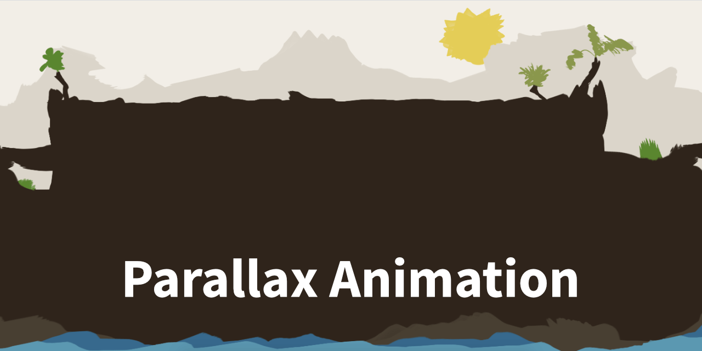

# Window-resize parallax

- [About](#about)
- [Examples](#examples)
- [How to use](#how-to-use)

 

---

  

## About

A subtle window-resize based parallax effect created for a real website as secret feature in the footer section.

  

## Examples

Find the live demo here:

- [Live preview »](https://christianoellers.github.io/Parallax-Animation-Effect)

  

## How to use

1. Make sure to view it in wide viewport - like `1920×1080px` - or zoom out to see the full animation.
2. Resize the window slowly (let's say about `50-100px` per step) and wait a little – `like 1 sec.` – after each step. The parallax animation will slowly follow the resize direction.

The animation will only start if the window is smaller than `1900px` but wider than `1000px`. This is to keep the footer element always in the centre (see screenshot).
